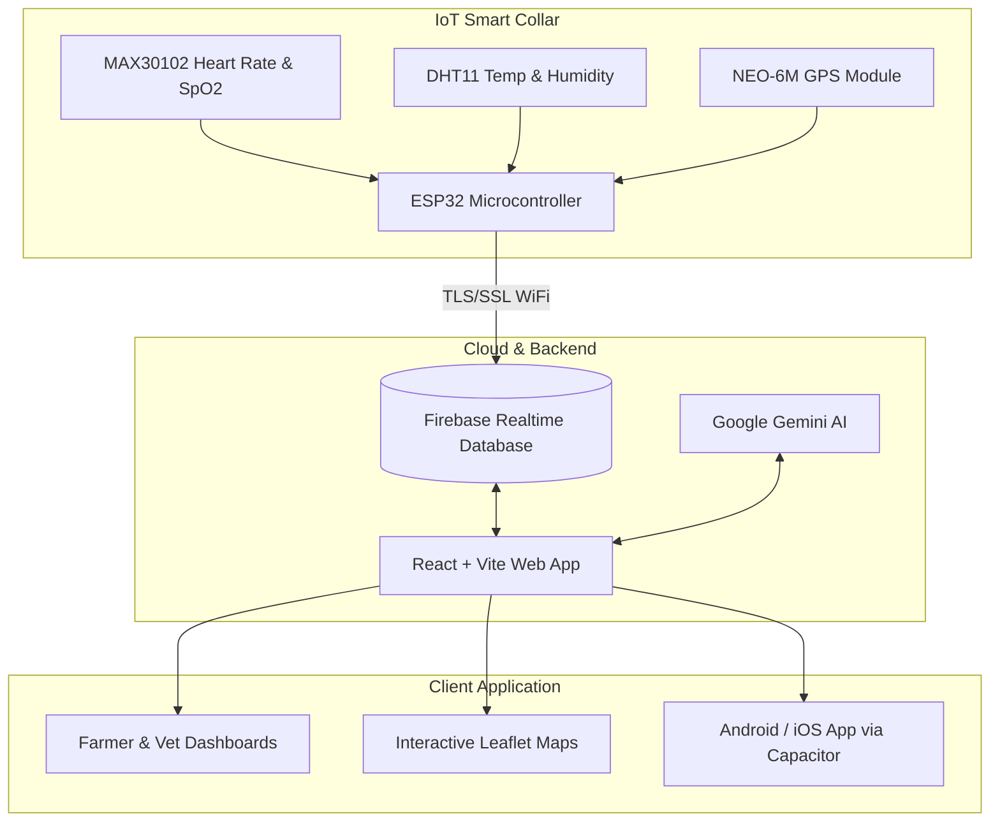

# 🐄 BioSense — Smart Livestock Collar & AI-Powered Cattle Health Platform

[](https://react.dev/)
[](https://vitejs.dev/)
[](https://tailwindcss.com/)
[](https://firebase.google.com/)
[](https://capacitorjs.com/)
[](https://ai.google.dev/)
[](https://www.espressif.com/)

**BioSense** is a comprehensive IoT and AI-driven smart livestock monitoring and veterinary telehealth ecosystem. It connects smart cattle collars to a cloud dashboard and mobile application, empowering dairy farmers and veterinarians with real-time biometric vitals, GPS geofencing, AI diagnostic assistance, and telehealth consultations.

---

## 📑 Table of Contents

- [Key Features](#-key-features)
- [System Architecture](#-system-architecture)
- [Hardware & IoT Specs](#-hardware--iot-specs)
  - [Pinout & Connections](#pinout--connections)
  - [Firmware Setup](#firmware-setup)
- [Software Tech Stack](#-software-tech-stack)
- [Project Directory Structure](#-project-directory-structure)
- [Getting Started](#-getting-started)
  - [Prerequisites](#prerequisites)
  - [Installation & Environment Setup](#installation--environment-setup)
  - [Running the Web App](#running-the-web-app)
- [Mobile Build (Capacitor)](#-mobile-build-capacitor)
- [Firebase Configuration](#-firebase-configuration)
- [Common Troubleshooting](#-common-troubleshooting)
- [License](#-license)

---

## 🌟 Key Features

### 📡 1. Real-Time IoT Telemetry & Biometrics
- **Heart Rate & SpO2 Monitoring:** Optical pulse oximetry with custom peak-detection algorithms.
- **Ambient & Body Temperature / Humidity:** Environmental heat stress monitoring via DHT11.
- **Live GPS Tracking & Geofencing:** Satellite-locked coordinates streamed to interactive Leaflet maps with safe pasture boundaries and straying alerts.
- **Battery & Collar Health:** Real-time node battery status and sensor diagnostics.

### 🤖 2. CattleCare AI (Powered by Google Gemini)
- Instant symptom checker for bovine diseases (e.g., Lumpy Skin Disease, Mastitis, Foot & Mouth).
- Actionable first-aid recommendations, diet plans, and quarantine guidelines in regional languages.

### 👨‍⚕️ 3. Veterinarian & Farmer Portals
- **Farmer Dashboard:** Herd overview, real-time alert feed, milking & fertility cycle logs.
- **Doctor Dashboard:** Assigned livestock, tele-consultation queue, digital prescription generator, and historical medical records.

### 🌐 4. Multilingual & Cross-Platform
- Localized in multiple languages (English, Hindi, Tamil, Malayalam, Kannada, etc.).
- Responsive web app + native mobile application (Android & iOS via Capacitor).

---

## 🏗️ System Architecture



---

## 🔌 Hardware & IoT Specs

### Pinout & Connections (ESP32)

| Component | ESP32 Pin | Interface / Protocol | Note |
| :--- | :--- | :--- | :--- |
| **MAX30102 (SDA)** | `GPIO 21` | I2C Data | Fast I2C (400kHz) |
| **MAX30102 (SCL)** | `GPIO 22` | I2C Clock | Pull-up enabled |
| **DHT11 (DATA)** | `GPIO 4` | 1-Wire Digital | Temp & Humidity |
| **NEO-6M GPS (TX)** | `GPIO 16 (RX2)` | HardwareSerial2 | 9600 Baud |
| **NEO-6M GPS (RX)** | `GPIO 17 (TX2)` | HardwareSerial2 | 9600 Baud |
| **VCC & GND** | `3.3V / 5V` & `GND` | Power Rails | Regulated supply |

---

## 💻 Software Tech Stack

| Domain | Technology |
| :--- | :--- |
| **Frontend UI** | [React 19](https://react.dev/), [Tailwind CSS v4](https://tailwindcss.com/), [Lucide React](https://lucide.dev/) |
| **Build & Bundler** | [Vite 8](https://vitejs.dev/) |
| **Maps & Geospatial**| [Leaflet](https://leafletjs.com/), [React Leaflet](https://react-leaflet.js.org/) |
| **Data Visualization**| [Recharts](https://recharts.org/) |
| **AI Diagnosis** | `@google/genai` (Google Gemini Pro / Flash) |
| **Mobile Runtime** | [Capacitor 6](https://capacitorjs.com/) (Android & iOS) |
| **Backend & Auth** | [Firebase Realtime Database](https://firebase.google.com/) & Firebase Auth |
| **Firmware** | C++ / Arduino IDE / PlatformIO with `Firebase_ESP_Client` |

---

## 📂 Project Directory Structure

```text
collar/
├── capacitor.config.ts        # Capacitor mobile configuration
├── index.html                 # HTML Entry point
├── package.json               # Dependencies & build scripts
├── vite.config.js             # Vite configuration with Tailwind
├── src/
│   ├── App.jsx                # Main application component & routes
│   ├── main.jsx               # React DOM root mounting
│   ├── index.css              # Global styles & Tailwind utilities
│   ├── assets/                # Static images, icons, and illustrations
│   ├── components/            # Reusable UI components (Navbar, Cards, Modals)
│   ├── context/               # Global state (Auth, Herd, Settings, Language)
│   ├── hooks/                 # Custom React hooks (telemetry, consultations)
│   ├── pages/                 # Route pages:
│   │   ├── Home.jsx           # Landing / Hero overview
│   │   ├── FarmerDashboard.jsx# Farmer telemetry and herd statistics
│   │   ├── DoctorDashboard.jsx# Veterinary medical hub
│   │   ├── GPSTracking.jsx    # Live geofence & cattle location map
│   │   ├── CattleCareAI.jsx   # Gemini AI livestock symptom assistant
│   │   ├── Consultation.jsx   # Telehealth chat & video consultations
│   │   ├── MedicalRecords.jsx # Vaccine, treatment, and medical logs
│   │   └── GovernmentSchemes.jsx # Cattle subsidy & insurance directory
│   ├── services/              # API clients (Firebase, Gemini AI, Cattle API)
│   └── translations/          # Multilingual dictionary JSONs
```

---

## 🚀 Getting Started

### Prerequisites
- **Node.js**: v18.0.0 or higher
- **npm** or **yarn** / **pnpm**
- **Arduino IDE** (with ESP32 board package installed) for collar firmware

### Installation & Environment Setup

1. **Clone the repository:**
   ```bash
   git clone https://github.com/your-username/biosense-collar.git
   cd collar
   ```

2. **Install frontend dependencies:**
   ```bash
   npm install
   ```

3. **Configure Environment Variables:**
   Create a `.env` file in the root directory:
   ```env
   VITE_FIREBASE_API_KEY=your_firebase_api_key
   VITE_FIREBASE_AUTH_DOMAIN=your_project.firebaseapp.com
   VITE_FIREBASE_DATABASE_URL=https://your_project-default-rtdb.asia-southeast1.firebasedatabase.app
   VITE_FIREBASE_PROJECT_ID=your_project_id
   VITE_FIREBASE_STORAGE_BUCKET=your_project.appspot.com
   VITE_FIREBASE_MESSAGING_SENDER_ID=your_sender_id
   VITE_FIREBASE_APP_ID=your_app_id
   VITE_GEMINI_API_KEY=your_google_gemini_api_key
   ```

### Running the Web App

Start the development server with Hot Module Replacement:
```bash
npm run dev
```
Open your browser at `http://localhost:5173`.

---

## 📱 Mobile Build (Capacitor)

Build the production web bundle and sync with native platforms:

```bash
# Build web assets and sync to native containers
npm run cap:sync

# Open in Android Studio
npm run cap:android

# Open in Xcode (macOS only)
npm run cap:ios
```

---

## 🔥 Firebase Configuration & Rules

1. Go to the [Firebase Console](https://console.firebase.google.com/).
2. Enable **Authentication** &rarr; **Sign-in method** &rarr; **Anonymous** (and Email/Password if used).
3. Create a **Realtime Database** and set the security rules:
   ```json
   {
     "rules": {
       ".read": true,
       ".write": true
     }
   }
   ```
4. Collar data will be published under `/telemetry/{COLLAR_ID}` in the following format:
   ```json
   {
     "heartRate": 72,
     "spo2": 98,
     "temperature": 38.6,
     "humidity": 65.0,
     "battery": 85,
     "lat": 10.574017,
     "lng": 76.215432
   }
   ```

---

## 🔧 Common Troubleshooting

| Issue | Cause | Fix |
| :--- | :--- | :--- |
| `SSL internals timed out!` on ESP32 | NTP clock not synced or invalid `DATABASE_URL` format | Ensure NTP `configTime(0, 0, "pool.ntp.org")` is called in `setup()` and `DATABASE_URL` has no Markdown brackets or trailing `/`. |
| `Firebase Auth Error: Token info` | Anonymous sign-in disabled | Enable **Anonymous** provider in Firebase Authentication console. |
| `MAX30102 NOT FOUND!` | I2C address/wiring issue | Check SDA (`GPIO 21`) and SCL (`GPIO 22`) connections and 3.3V power. |
| `Leaflet map tiles not rendering` | Missing Leaflet CSS | Ensure `leaflet/dist/leaflet.css` is imported in `main.jsx` or `index.html`. |

---

## 📄 License

This project is licensed under the [MIT License](LICENSE).
